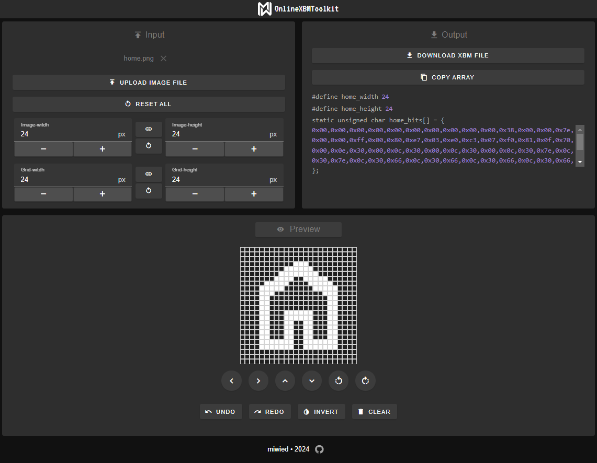
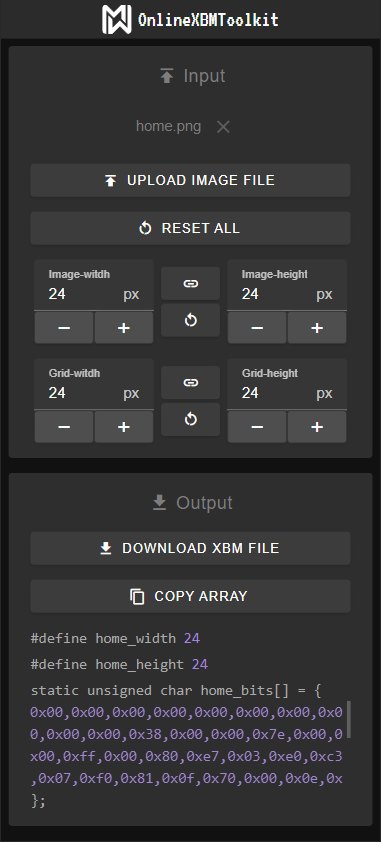

# OnlineXBMToolkit

This web-based tool was designed for editing and converting images into the XBM
(X BitMap) format. I developed it with [Vue.js](https://vuejs.org/) and the
[Vuetify component framework](https://vuetifyjs.com/) for a private project and
now I wanted to outsource it as a standalone app. It has many bundled features
compared to other xbm-editors.

# Demo

You are welcome to test and use the tool yourself under the
[following link](https://miwied.github.io/OnlineXBMToolkit/).

# Features:

### Input-section

- Uploading image files (SVG, PNG, JPG, JPEG), which will be automatically
  converted to the xbm format considering the specified grid and image sizes

- Customize the image and grid sizes, with individual control over width and
  height, the lock button allows maintaining equal dimensions

### Edit- / preview-section

#### Edit-mode

- Manipulate the XBM array by clicking on the grid
- Shift the pixels (left, right, up, down)
- Rotate the image (left, right)
- Invert the image
- Clear the whole grid
- Undo and redo your actions

#### Preview-mode

- Visual representation of the XBM data ("readonly")

### Output-section

- Download the converted XBM file or copy the XBM array to the clipboard
- Formatted version of the XBM array which can also be manipulated

### General

- Responsive design
- User notifications

# Limitations

- Large grid sizes have not been taken into account in this application. The
  visualization may suffer as a result.

# Screenshots

| desktop                                                        | mobile                                                             |
| -------------------------------------------------------------- | ------------------------------------------------------------------ |
|  |  |
